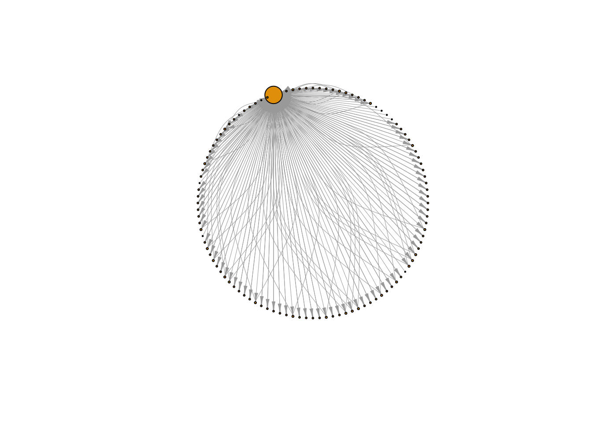

<!-- README.md is generated from README.Rmd. Please edit that file -->
    __________________________oooo__oo____________________
    _ooooo__oo_ooo___ooooo___oo_____oo_____ooooo__oo_ooo__
    oo___oo_ooo___o_oo___oo_ooooo__oooo___oo____o_ooo___o_
    oo______oo______oo___oo_oo______oo____ooooooo_oo______
    oo______oo______oo___oo_oo______oo__o_oo______oo______
    _ooooo__oo_______oooo_o_oo_______ooo___ooooo__oo______
    ______________________________________________________

crafter : Tools to Analyze and Visualize Network Packet Capture (PCAP) Files

Life's too short to export to CSV/XML. There's no reason R should not be able to read binary PCAP data.

[What is a PCAP?](https://en.wikipedia.org/wiki/Pcap)

You need the [crafter C++ library](https://github.com/pellegre/libcrafter) installed and their site lists the other dependencies.

If there's any hope for this to run on Windows (`libcrafter` supports Windows) it will be due to a Windows + (prbly some infosec) + `#rstats` person tagging along on this project.

You can find some sample PCAP files:

-   [Netresec](https://wiki.wireshark.org/SampleCaptures)
-   [Wireshark](https://wiki.wireshark.org/SampleCaptures)

The following functions are implemented:

-   `read_pcap`: Read in a packet capture file
-   `summary.crafter`: Print summary info about a packet capture

(The `pcap` in the functions below is the return value from a call to `read_pcap`.)

-   `pcap$get_layer`: return a data.frame with the indicated protocol layer from the pcap packets
-   `pcap$packet_info`: retrieve a data frame of high level packet info
-   `pcap$get_payload`: retrieve payload (if any) from a given packet number

(There are actually more but they're inside the pcap object and I just need to get them exposed. See the example below for usage.)

### News

-   Version 0.1.3.9000 : rudimentary payload data!
-   Version 0.1.2.9000 : added ICMP layer
-   Version 0.1.1.9000 : restored packet number in data frame & added TCP layer
-   Version 0.1.0.9000 : very basic functionality (IP layer)!
-   Version 0.0.1.9000 : refactor into classed environment
-   Version 0.0.0.9000 : released

### Installation

``` r
devtools::install_github("hrbrmstr/crafter")
```

### Usage

``` r
library(crafter)

# current verison
packageVersion("crafter")
#> [1] '0.1.3.9000'

library(crafter)
library(dplyr)
#> 
#> Attaching package: 'dplyr'
#> 
#> The following objects are masked from 'package:stats':
#> 
#>     filter, lag
#> 
#> The following objects are masked from 'package:base':
#> 
#>     intersect, setdiff, setequal, union
library(ggplot2)

# read in the "honeybot" packet capture from the "Capture the hacker 2013"
# competition (by Dr. David Day of Sheffield Hallam University) http://www.snaketrap.co.uk/
hbot <- read_pcap(system.file("pcaps/hbot.pcap", package="crafter"))

# high level statistics
summary(hbot)
#> File
#>  Capture file  : /Library/Frameworks/R.framework/Versions/3.2/Resources/library/crafter/pcaps/hbot.pcap
#>  Filter applied: [none]
#>  Length        : 1204229 bytes
#> 
#> Time
#>  First packet: 2013-01-09 15:33:20
#>  Last packet : 2013-01-12 15:19:20
#> 
#> Statistics
#>  Packets      : 5450
#>  Time span (s): 258360.620
#>  Average pps  : 0.0

# look at general packet info
head(hbot$packet_info(), 15)
#>    num     tv_sec tv_usec layer_count                                                               protocols
#> 1    1 1357913756  642112           4                                                Ethernet,IP,RawLayer,UDP
#> 2    2 1357913756  652518           4                                                Ethernet,IP,RawLayer,UDP
#> 3    3 1357913756  661374           4                                                Ethernet,IP,RawLayer,UDP
#> 4    4 1357913756  768192           4                                                Ethernet,IP,RawLayer,UDP
#> 5    5 1357913763   22726           4                                                Ethernet,IP,RawLayer,UDP
#> 6    6 1357913763   32152           4                                                Ethernet,IP,RawLayer,UDP
#> 7    7 1357913763   34026           7 Ethernet,IP,TCP,TCPOptionMaxSegSize,TCPOptionPad,TCPOptionSACKPermitted
#> 8    8 1357913763   60454           7 Ethernet,IP,TCP,TCPOptionMaxSegSize,TCPOptionPad,TCPOptionSACKPermitted
#> 9    9 1357913763   60517           3                                                         Ethernet,IP,TCP
#> 10  10 1357913763   61083           4                                                Ethernet,IP,RawLayer,TCP
#> 11  11 1357913763   89809           3                                                         Ethernet,IP,TCP
#> 12  12 1357913763   90103           4                                                Ethernet,IP,RawLayer,TCP
#> 13  13 1357913763  137534           4                                                Ethernet,IP,RawLayer,UDP
#> 14  14 1357913763  147996           4                                                Ethernet,IP,RawLayer,UDP
#> 15  15 1357913763  149377           7 Ethernet,IP,TCP,TCPOptionMaxSegSize,TCPOptionPad,TCPOptionSACKPermitted
#>    packet_size
#> 1           83
#> 2          195
#> 3           88
#> 4           61
#> 5           79
#> 6           95
#> 7           62
#> 8           62
#> 9           54
#> 10         162
#> 11          54
#> 12         452
#> 13          80
#> 14          96
#> 15          62

# look at the IP layer packets
head(hbot$get_layer("IP"), 20)
#>    num     tv_sec tv_usec            src            dst protocol_name size header_len total_len ttl flags flag_bits
#> 1    1 1357913756  642112  192.168.0.200  194.168.4.100           UDP   83          5        69 128     0       000
#> 2    2 1357913756  652518  194.168.4.100  192.168.0.200           UDP  195          5       181 253     2       010
#> 3    3 1357913756  661374  192.168.0.200  199.66.201.20           UDP   88          5        74 128     0       000
#> 4    4 1357913756  768192  199.66.201.20  192.168.0.200           UDP   61          5        47  51     2       010
#> 5    5 1357913763   22726  192.168.0.200  194.168.4.100           UDP   79          5        65 128     0       000
#> 6    6 1357913763   32152  194.168.4.100  192.168.0.200           UDP   95          5        81 253     2       010
#> 7    7 1357913763   34026  192.168.0.200 91.199.212.171           TCP   62          5        48 128     2       010
#> 8    8 1357913763   60454 91.199.212.171  192.168.0.200           TCP   62          5        48  49     2       010
#> 9    9 1357913763   60517  192.168.0.200 91.199.212.171           TCP   54          5        40 128     2       010
#> 10  10 1357913763   61083  192.168.0.200 91.199.212.171           TCP  162          5       148 128     2       010
#> 11  11 1357913763   89809 91.199.212.171  192.168.0.200           TCP   54          5        40  49     2       010
#> 12  12 1357913763   90103 91.199.212.171  192.168.0.200           TCP  452          5       438  49     2       010
#> 13  13 1357913763  137534  192.168.0.200  194.168.4.100           UDP   80          5        66 128     0       000
#> 14  14 1357913763  147996  194.168.4.100  192.168.0.200           UDP   96          5        82 253     2       010
#> 15  15 1357913763  149377  192.168.0.200   178.255.82.1           TCP   62          5        48 128     2       010
#> 16  16 1357913763  228146  192.168.0.200 91.199.212.171           TCP   54          5        40 128     2       010
#> 17  17 1357913763  247620   178.255.82.1  192.168.0.200           TCP   62          5        48  49     2       010
#> 18  18 1357913763  247671  192.168.0.200   178.255.82.1           TCP   54          5        40 128     2       010
#> 19  19 1357913763  248170  192.168.0.200   178.255.82.1           TCP  187          5       173 128     2       010
#> 20  20 1357913763  348497   178.255.82.1  192.168.0.200           TCP   54          5        40  49     2       010
#>    dscp frag_ofs
#> 1     0        0
#> 2     0        0
#> 3     0        0
#> 4     0        0
#> 5     0        0
#> 6     0        0
#> 7     0        0
#> 8     0        0
#> 9     0        0
#> 10    0        0
#> 11    0        0
#> 12    0        0
#> 13    0        0
#> 14    0        0
#> 15    0        0
#> 16    0        0
#> 17    0        0
#> 18    0        0
#> 19    0        0
#> 20    0        0

# look at the TCP layer packets
head(hbot$get_layer("TCP"), 20)
#>    num     tv_sec tv_usec            src            dst protocol_name srcport dstport     seqnum     acknum headersize
#> 1    7 1357913763   34026  192.168.0.200 91.199.212.171           TCP    1033      80 3814599572          0         20
#> 2    8 1357913763   60454 91.199.212.171  192.168.0.200           TCP      80    1033 1804036196 3814599573         20
#> 3    9 1357913763   60517  192.168.0.200 91.199.212.171           TCP    1033      80 3814599573 1804036197         20
#> 4   10 1357913763   61083  192.168.0.200 91.199.212.171           TCP    1033      80 3814599573 1804036197         20
#> 5   11 1357913763   89809 91.199.212.171  192.168.0.200           TCP      80    1033 1804036197 3814599681         20
#> 6   12 1357913763   90103 91.199.212.171  192.168.0.200           TCP      80    1033 1804036197 3814599681         20
#> 7   15 1357913763  149377  192.168.0.200   178.255.82.1           TCP    1035      80 1589035848          0         20
#> 8   16 1357913763  228146  192.168.0.200 91.199.212.171           TCP    1033      80 3814599681 1804036595         20
#> 9   17 1357913763  247620   178.255.82.1  192.168.0.200           TCP      80    1035 2486095265 1589035849         20
#> 10  18 1357913763  247671  192.168.0.200   178.255.82.1           TCP    1035      80 1589035849 2486095266         20
#> 11  19 1357913763  248170  192.168.0.200   178.255.82.1           TCP    1035      80 1589035849 2486095266         20
#> 12  20 1357913763  348497   178.255.82.1  192.168.0.200           TCP      80    1035 2486095266 1589035982         20
#> 13  21 1357913763  348961   178.255.82.1  192.168.0.200           TCP      80    1035 2486095266 1589035982         20
#> 14  22 1357913763  349525   178.255.82.1  192.168.0.200           TCP      80    1035 2486096726 1589035982         20
#> 15  23 1357913763  349762  192.168.0.200   178.255.82.1           TCP    1035      80 1589035982 2486098186         20
#> 16  24 1357913763  350125   178.255.82.1  192.168.0.200           TCP      80    1035 2486098186 1589035982         20
#> 17  25 1357913763  448811   178.255.82.1  192.168.0.200           TCP      80    1035 2486099646 1589035982         20
#> 18  26 1357913763  449199  192.168.0.200   178.255.82.1           TCP    1035      80 1589035982 2486099703         20
#> 19  27 1357913765   88525 91.199.212.171  192.168.0.200           TCP      80    1033 1804036595 3814599681         20
#> 20  28 1357913765   88703  192.168.0.200 91.199.212.171           TCP    1033      80 3814599681 1804036596         20
#>    payloadsize   fin   syn   rst   psh   ack   urg   ece   cwr
#> 1            0 FALSE  TRUE FALSE FALSE FALSE FALSE FALSE FALSE
#> 2            0 FALSE  TRUE FALSE FALSE  TRUE FALSE FALSE FALSE
#> 3            0 FALSE FALSE FALSE FALSE  TRUE FALSE FALSE FALSE
#> 4          108 FALSE FALSE FALSE  TRUE  TRUE FALSE FALSE FALSE
#> 5            0 FALSE FALSE FALSE FALSE  TRUE FALSE FALSE FALSE
#> 6          398 FALSE FALSE FALSE  TRUE  TRUE FALSE FALSE FALSE
#> 7            0 FALSE  TRUE FALSE FALSE FALSE FALSE FALSE FALSE
#> 8            0 FALSE FALSE FALSE FALSE  TRUE FALSE FALSE FALSE
#> 9            0 FALSE  TRUE FALSE FALSE  TRUE FALSE FALSE FALSE
#> 10           0 FALSE FALSE FALSE FALSE  TRUE FALSE FALSE FALSE
#> 11         133 FALSE FALSE FALSE  TRUE  TRUE FALSE FALSE FALSE
#> 12           0 FALSE FALSE FALSE FALSE  TRUE FALSE FALSE FALSE
#> 13        1460 FALSE FALSE FALSE FALSE  TRUE FALSE FALSE FALSE
#> 14        1460 FALSE FALSE FALSE FALSE  TRUE FALSE FALSE FALSE
#> 15           0 FALSE FALSE FALSE FALSE  TRUE FALSE FALSE FALSE
#> 16        1460 FALSE FALSE FALSE FALSE  TRUE FALSE FALSE FALSE
#> 17          57 FALSE FALSE FALSE  TRUE  TRUE FALSE FALSE FALSE
#> 18           0 FALSE FALSE FALSE FALSE  TRUE FALSE FALSE FALSE
#> 19           0  TRUE FALSE FALSE FALSE  TRUE FALSE FALSE FALSE
#> 20           0 FALSE FALSE FALSE FALSE  TRUE FALSE FALSE FALSE
#>                                                                                                                                                                                                                                                                                                                                                                                                                                                                                                                                                                                                                                                                                                                                                                                                                                                                                                                                                                                                                                                                                                                                                                                                                                                                                                                                                                                                                                                                                                                                                                                                                                                                     payload
#> 1                                                                                                                                                                                                                                                                                                                                                                                                                                                                                                                                                                                                                                                                                                                                                                                                                                                                                                                                                                                                                                                                                                                                                                                                                                                                                                                                                                                                                                                                                                                                                                                                                                                                          
#> 2                                                                                                                                                                                                                                                                                                                                                                                                                                                                                                                                                                                                                                                                                                                                                                                                                                                                                                                                                                                                                                                                                                                                                                                                                                                                                                                                                                                                                                                                                                                                                                                                                                                                          
#> 3                                                                                                                                                                                                                                                                                                                                                                                                                                                                                                                                                                                                                                                                                                                                                                                                                                                                                                                                                                                                                                                                                                                                                                                                                                                                                                                                                                                                                                                                                                                                                                                                                                                                          
#> 4                                                                                                                                                                                                                                                                                                                                                                                                                                                                                                                                                                                                                                                                                                                                                                                                                                                                                                                                                                                                                                                                                                                                                                                                                                                                                                                                                                                                                                                                                                                                                    GET /av/tvl/deletedvendors.txt HTTP/1.1\r\nAccept: */*\r\nHost: download.comodo.com\r\nCache-Control: no-cache\r\n\r\n
#> 5                                                                                                                                                                                                                                                                                                                                                                                                                                                                                                                                                                                                                                                                                                                                                                                                                                                                                                                                                                                                                                                                                                                                                                                                                                                                                                                                                                                                                                                                                                                                                                                                                                                                          
#> 6                                                                                                                                                                                                                                                                                                                                                                                                                                                                                                                                                                                                                                                                                                                                                                                                                                                                                                                                                                                                                                                                                                                                                                                                                            HTTP/1.1 302 Moved Temporarily\r\nServer: nginx\r\nDate: Fri, 11 Jan 2013 14:16:03 GMT\r\nContent-Type: text/html\r\nContent-Length: 154\r\nConnection: keep-alive\r\nKeep-Alive: timeout=1\r\nLocation: http://downloads.comodo.com/av/tvl/deletedvendors.txt\r\n\r\n<html>\r\n<head><title>302 Found</title></head>\r\n<body bgcolor="white">\r\n<center><h1>302 Found</h1></center>\r\n<hr><center>nginx</center>\r\n</body>\r\n</html>\r\n
#> 7                                                                                                                                                                                                                                                                                                                                                                                                                                                                                                                                                                                                                                                                                                                                                                                                                                                                                                                                                                                                                                                                                                                                                                                                                                                                                                                                                                                                                                                                                                                                                                                                                                                                          
#> 8                                                                                                                                                                                                                                                                                                                                                                                                                                                                                                                                                                                                                                                                                                                                                                                                                                                                                                                                                                                                                                                                                                                                                                                                                                                                                                                                                                                                                                                                                                                                                                                                                                                                          
#> 9                                                                                                                                                                                                                                                                                                                                                                                                                                                                                                                                                                                                                                                                                                                                                                                                                                                                                                                                                                                                                                                                                                                                                                                                                                                                                                                                                                                                                                                                                                                                                                                                                                                                          
#> 10                                                                                                                                                                                                                                                                                                                                                                                                                                                                                                                                                                                                                                                                                                                                                                                                                                                                                                                                                                                                                                                                                                                                                                                                                                                                                                                                                                                                                                                                                                                                                                                                                                                                         
#> 11                                                                                                                                                                                                                                                                                                                                                                                                                                                                                                                                                                                                                                                                                                                                                                                                                                                                                                                                                                                                                                                                                                                                                                                                                                                                                                                                                                                                                                                                                                                        GET /av/tvl/deletedvendors.txt HTTP/1.1\r\nAccept: */*\r\nConnection: Keep-Alive\r\nCache-Control: no-cache\r\nHost: downloads.comodo.com\r\n\r\n
#> 12                                                                                                                                                                                                                                                                                                                                                                                                                                                                                                                                                                                                                                                                                                                                                                                                                                                                                                                                                                                                                                                                                                                                                                                                                                                                                                                                                                                                                                                                                                                                                                                                                                                                         
#> 13 HTTP/1.1 200 OK\r\nServer: nginx\r\nDate: Fri, 11 Jan 2013 14:16:03 GMT\r\nContent-Type: text/plain\r\nContent-Length: 4147\r\nLast-Modified: Wed, 19 Dec 2012 15:51:29 GMT\r\nConnection: keep-alive\r\nKeep-Alive: timeout=1\r\nVary: Accept-Encoding\r\nX-CCACDN-Mirror-ID: t8edcgdown5\r\nAccept-Ranges: bytes\r\n\r\nAignesberger Software GmbH\r\nAlienware Corporation\r\nALIKET SOFTWARE CO., LTD.\r\nAsk.com\r\nBolide Software\r\nByteSphere Technologies LLC\r\nConduit Ltd.\r\nCyberDefender Corp.\r\nDigital River, Inc.\r\nEltima Software\r\nEsystech Indústria e Comércio Ltda\r\nFree Peers Inc.\r\nHolz Thomas\r\nIlya Kheifets\r\nKwinzy.com\r\nLe Software Man Ltd\r\nMeMedia\r\nMetaProducts Corporation\r\nMusiclab, LLC\r\nNCH Software\r\nNCH Swift Sound\r\nNsasoft LLC.\r\nPatchou\r\nPC Drivers HeadQuarters, Inc\r\nRealVNC Ltd\r\nRediff.com India Limited\r\nSoftDD Software\r\nKwanzy.com\r\nebiznetworks\r\neBizNetworks Co.,Ltd.\r\nHappyscreensavers.com\r\nQueryExplorer.com\r\nSecureSoft\r\nZinkSeek.com\r\nZinkzo.com\r\nZinkWink.com\r\nBrowserDiscover.com\r\nBrowserQuery.com\r\nBrowserSeek.com\r\nQueryBrowse.com\r\nQuestBrowse.com\r\nResultBrowser.com\r\nResultDns.com\r\nResultTool.com\r\nResultUrl.com\r\nWeemi.com\r\nWinkZink.com\r\nWyeke.com\r\nWyyo.com\r\nComputer Business Solutions, Inc.\r\nDNAML PTY LTD\r\nWhiteSmoke Inc\r\nWHENU.COM\r\nWHENU.COM INC\r\nWhere's George? LLC\r\nQuestUrl.com\r\nCreativeToolbarSolutions.com\r\nZwunzi.com\r\nZwankySearch.com\r\nZwangie.com\r\nZwangi.com\r\njdoctor\r\njynetworks\r\nJiniInfo\r\nWeiSiTianYu Software Develop Service Center\r\nthe best offers network
#> 14           , llc.\r\neCode Sky Network Technology Co., Ltd.\r\nAlexa Internet\r\neAcceleration Corporation\r\nThe World Gate, Inc\r\niWin, Inc\r\nCOMARCH S.A.\r\nVomba Network\r\nuvnc bvba\r\nWeatherBug\r\nZhejiang HaoYing Network Co.,Ltd\r\nnanjing wangya computer co.\r\nNanJing WangYa Computer Co., Ltd.\r\nBeijing Huyangfeng Information Technology Co., Ltd.\r\nBit Wise Publishing, LLC\r\nBrodin Asset Management\r\nCommunication Horizons\r\nDREAMGROUP\r\nEffective Measure International Pty Ltd\r\nEVERYZONE. Inc.\r\nEZLinks Golf, Inc.\r\nFisher-Price, Inc.\r\nFreeCause, Inc.\r\nVolker Feldmann Software GmbH\r\nVoltron Corporation\r\nWebteh d.o.o.\r\nWindowlink Ltd\r\nWINDOWSTOOL\r\nWindward Software Inc\r\nX2Net DEMO Certificate Only\r\nXf trade LLP\r\nZemerick Software, Inc.\r\nWindward Software Inc.\r\nFreeCause Inc.\r\nEVERYZONE. Inc.\r\nMake The Web Better, LLC\r\nMicroSmarts LLC\r\nMochaSoft Aps\r\nORPALIS\r\nQuicken Australia\r\nRapid Decision Corporation\r\nReklosoft LLC\r\nRhino Software Inc.\r\nSharony Management Services Ltd.\r\nSmartLine Inc\r\nSnappy Fox Software\r\nSystem Update BR\r\nTeslain\r\nThe Illumen Group, Inc.\r\nTurboPower Software Company\r\nUNIBANCO - UNIAO DE BANCOS BRASILEIROS S/A\r\nUUSEE Inc.\r\nUUSee Inc.\r\nUiTV Inc.\r\nVNN Networks, Inc.\r\nViewpoint Corporation\r\nVisicom Media Inc.\r\nVoiceFive Networks, Inc.\r\nVoicefive Networks, Inc.\r\nmgoonmedia Inc\r\nmone\r\nAltrixSoft Ltd\r\nSafeApp Software, LLC\r\nAvalanche LLC\r\nglobe7 inc\r\nUnilogix Solutions Pte. Ltd\r\nQUALTIVA TECHNOLOGIES LLC\r\nAdvanced Search Technologies, Inc.\r\nZugo Ltd\r\nAOS
#> 15                                                                                                                                                                                                                                                                                                                                                                                                                                                                                                                                                                                                                                                                                                                                                                                                                                                                                                                                                                                                                                                                                                                                                                                                                                                                                                                                                                                                                                                                                                                                                                                                                                                                         
#> 16                          Technologies, Inc.\r\nAscentive LLC\r\nAtelierWeb Software\r\nAxolotl Online Inc.\r\nCentralGest, SA\r\nAJSystems.com Inc.\r\nNetRatings, Inc.\r\nPatrick Jansen\r\nTelemate\r\nSecurityFriday Co. Ltd.\r\nInfoWorks Technology Company\r\nPPLive Corporation\r\nRealVNC Limited\r\nPartyGaming Services\r\nMarket Precision, Inc.\r\nMax Secure Software India Pvt. Ltd.\r\nSmart PC Solutions, Inc.\r\nMax Secure Software\r\nSmart Soft\r\nFamatech Corp.\r\nZemana Information Technologies Industry Limited\r\nDataMystic\r\nXionix\r\nAmmyy Group\r\n北京聚金振业科技有限公司\r\nEorezo\r\nMedia Get LLC\r\nVittalia Internet S.L\r\nJ2networks\r\nSuzhou Shijie Software Co., LTD\r\nFuzhou TianxiaChuangshi Digital Co.,Ltd.\r\nSafe Decision, Inc\r\nAthena IT Limited\r\nPassware Inc. Limited\r\nYoics, Inc\r\nSmartCode Solutions\r\nDubai Click LLC\r\nAlexander Avdonin\r\nAtomPark Software JSV\r\nWebMinds, Inc\r\nwinwinnetworks\r\nWorld Multimedia Group\r\nWorldWinner.com, Inc.\r\nmIRC Co. Ltd.\r\nAlactro LLC\r\nSolimba Aplicaciones S.L.\r\nREDACCENIR SL\r\nKoyote-Lab Inc.\r\nMusicLab LLC\r\niMesh Inc.\r\nSun River Systems, Inc.\r\nSRC Technologies\r\nSolid Quest Inc.\r\nClaria Corporation\r\nSmart Line Incorporated\r\nSARL POINTDEV\r\nRecovery Toolbox, Inc.\r\nDaniel Offer\r\nDDX SOFTWARE, INC\r\nDeskToolsSoft\r\nDevice Doctor Software Inc.\r\nMedia Labs Limited\r\nPixel-Tech s.c. J. Pytowski, P.Kubarek\r\nPconPoint.com\r\nd & p media GmbH\r\nElectraSoft\r\nWEB PICK - INTERNET HOLDINGS LTD\r\nScreaming Bee\r\n보안연구소(주)\r\nSoftonic International\r\nAlawar Entertainment Inc\r\nLLC
#> 17                                                                                                                                                                                                                                                                                                                                                                                                                                                                                                                                                                                                                                                                                                                                                                                                                                                                                                                                                                                                                                                                                                                                                                                                                                                                                                                                                                                                                                                                                                                                                                                                           Mail.Ru\r\nA&B Software LLC\r\nW3i, LLC\r\nRoy Morgan Research
#> 18                                                                                                                                                                                                                                                                                                                                                                                                                                                                                                                                                                                                                                                                                                                                                                                                                                                                                                                                                                                                                                                                                                                                                                                                                                                                                                                                                                                                                                                                                                                                                                                                                                                                         
#> 19                                                                                                                                                                                                                                                                                                                                                                                                                                                                                                                                                                                                                                                                                                                                                                                                                                                                                                                                                                                                                                                                                                                                                                                                                                                                                                                                                                                                                                                                                                                                                                                                                                                                         
#> 20

# look at the ICMP layer packets
head(hbot$get_layer("ICMP"), 20)
#>     num     tv_sec tv_usec            src            dst protocol_name identifier seqnum icmptype   icmpname code
#> 1   197 1357916383  467873  192.168.0.200    192.168.0.1          ICMP        512    256        8       Echo    0
#> 2   199 1357916383  574201    192.168.0.1  192.168.0.200          ICMP        512    256        0 Echo Reply    0
#> 3   200 1357916384  494965  192.168.0.200    192.168.0.1          ICMP        512    512        8       Echo    0
#> 4   201 1357916384  496694    192.168.0.1  192.168.0.200          ICMP        512    512        0 Echo Reply    0
#> 5   202 1357916385  511023  192.168.0.200    192.168.0.1          ICMP        512    768        8       Echo    0
#> 6   203 1357916385  512659    192.168.0.1  192.168.0.200          ICMP        512    768        0 Echo Reply    0
#> 7   204 1357916386  512477  192.168.0.200    192.168.0.1          ICMP        512   1024        8       Echo    0
#> 8   205 1357916386  514069    192.168.0.1  192.168.0.200          ICMP        512   1024        0 Echo Reply    0
#> 9  3045 1357902753  893262  192.168.0.200    192.168.0.1          ICMP        512    256        8       Echo    0
#> 10 3046 1357902753  894501    192.168.0.1  192.168.0.200          ICMP        512    256        0 Echo Reply    0
#> 11 3047 1357902754  899395  192.168.0.200    192.168.0.1          ICMP        512    512        8       Echo    0
#> 12 3048 1357902754  901673    192.168.0.1  192.168.0.200          ICMP        512    512        0 Echo Reply    0
#> 13 3049 1357902755  899459  192.168.0.200    192.168.0.1          ICMP        512    768        8       Echo    0
#> 14 3050 1357902755  902850    192.168.0.1  192.168.0.200          ICMP        512    768        0 Echo Reply    0
#> 15 3053 1357902762  856809  192.168.0.200 173.194.67.106          ICMP        512   1024        8       Echo    0
#> 16 3054 1357902762  881106 173.194.67.106  192.168.0.200          ICMP        512   1024        0 Echo Reply    0
#> 17 3055 1357902763  870699  192.168.0.200 173.194.67.106          ICMP        512   1280        8       Echo    0
#> 18 3056 1357902763  894322 173.194.67.106  192.168.0.200          ICMP        512   1280        0 Echo Reply    0
#> 19 3057 1357902764  886429  192.168.0.200 173.194.67.106          ICMP        512   1536        8       Echo    0
#> 20 3058 1357902764  913482 173.194.67.106  192.168.0.200          ICMP        512   1536        0 Echo Reply    0
#>    chksum
#> 1   19036
#> 2   21084
#> 3   18780
#> 4   20828
#> 5   18524
#> 6   20572
#> 7   18268
#> 8   20316
#> 9   19036
#> 10  21084
#> 11  18780
#> 12  20828
#> 13  18524
#> 14  20572
#> 15  18268
#> 16  20316
#> 17  18012
#> 18  20060
#> 19  17756
#> 20  19804

# see the protocol distribution
hbot$get_layer("IP") %>% 
  count(protocol_name) %>% 
  ggplot(aes(x=protocol_name, y=n)) + 
  geom_bar(stat="identity") + 
  labs(x=NULL, title="Honeybot IP Protocols") + 
  theme_bw()
```



### Test Results

``` r
library(crafter)
library(testthat)

date()
#> [1] "Sat Aug 15 10:38:51 2015"

test_dir("tests/")
#> testthat results ========================================================================================================
#> OK: 0 SKIPPED: 0 FAILED: 0
#> 
#> DONE
```

### Code of Conduct

Please note that this project is released with a [Contributor Code of Conduct](CONDUCT.md). By participating in this project you agree to abide by its terms.
