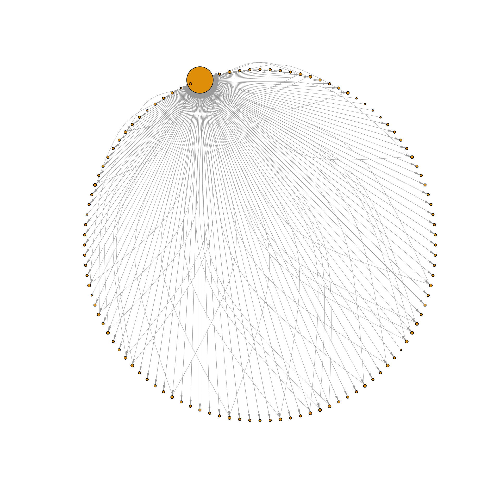
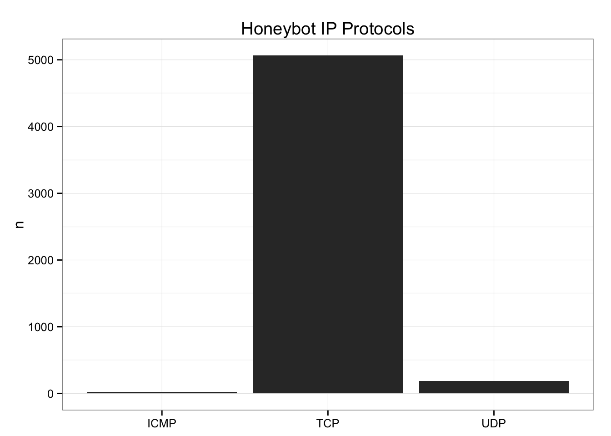

<!-- README.md is generated from README.Rmd. Please edit that file -->
    __________________________oooo__oo____________________
    _ooooo__oo_ooo___ooooo___oo_____oo_____ooooo__oo_ooo__
    oo___oo_ooo___o_oo___oo_ooooo__oooo___oo____o_ooo___o_
    oo______oo______oo___oo_oo______oo____ooooooo_oo______
    oo______oo______oo___oo_oo______oo__o_oo______oo______
    _ooooo__oo_______oooo_o_oo_______ooo___ooooo__oo______
    ______________________________________________________

crafter : Tools to Analyze and Visualize Network Packet Capture (PCAP) Files

Life's too short to export to CSV/XML. There's no reason R should not be able to read binary PCAP data.

[What is a PCAP?](https://en.wikipedia.org/wiki/Pcap)

You need the [crafter C++ library](https://github.com/pellegre/libcrafter) installed and their site lists the other dependencies.

If there's any hope for this to run on Windows (`libcrafter` supports Windows) it will be due to a Windows + (prbly some infosec) + `#rstats` person tagging along on this project.

You can find some sample PCAP files:

-   [Netresec](https://wiki.wireshark.org/SampleCaptures)
-   [Wireshark](https://wiki.wireshark.org/SampleCaptures)

The following functions are implemented:

-   `read_pcap`: Read in a packet capture file
-   `summary.crafter`: Print summary info about a packet capture

(The `pcap` in the functions below is the return value from a call to `read_pcap`.)

-   `pcap$get_layer`: return a data.frame with the indicated protocol layer from the pcap packets
-   `pcap$packet_info`: retrieve a data frame of high level packet info
-   `pcap$get_payload`: retrieve payload (if any) from a given packet number

(There are actually more but they're inside the pcap object and I just need to get them exposed. See the example below for usage.)

### News

-   Version 0.1.3.9000 : rudimentary payload data!
-   Version 0.1.2.9000 : added ICMP layer
-   Version 0.1.1.9000 : restored packet number in data frame & added TCP layer
-   Version 0.1.0.9000 : very basic functionality (IP layer)!
-   Version 0.0.1.9000 : refactor into classed environment
-   Version 0.0.0.9000 : released

### Installation

``` r
devtools::install_github("hrbrmstr/crafter")
```

### Usage

``` r
library(crafter)

# current verison
packageVersion("crafter")
#> [1] '0.1.3.9000'

library(crafter)
library(dplyr)
#> 
#> Attaching package: 'dplyr'
#> 
#> The following objects are masked from 'package:stats':
#> 
#>     filter, lag
#> 
#> The following objects are masked from 'package:base':
#> 
#>     intersect, setdiff, setequal, union
library(ggplot2)
library(igraph)
#> 
#> Attaching package: 'igraph'
#> 
#> The following objects are masked from 'package:dplyr':
#> 
#>     %>%, as_data_frame, groups, union
#> 
#> The following objects are masked from 'package:stats':
#> 
#>     decompose, spectrum
#> 
#> The following object is masked from 'package:base':
#> 
#>     union

# read in the "honeybot" packet capture from the "Capture the hacker 2013"
# competition (by Dr. David Day of Sheffield Hallam University) http://www.snaketrap.co.uk/
hbot <- read_pcap(system.file("pcaps/hbot.pcap", package="crafter"))

# high level statistics
summary(hbot)
#> File
#>  Capture file  : /Library/Frameworks/R.framework/Versions/3.2/Resources/library/crafter/pcaps/hbot.pcap
#>  Filter applied: [none]
#>  Length        : 1204229 bytes
#> 
#> Time
#>  First packet: 2013-01-09 15:33:20
#>  Last packet : 2013-01-12 15:19:20
#> 
#> Statistics
#>  Packets      : 5450
#>  Time span (s): 258360.620
#>  Average pps  : 0.0

# look at general packet info
head(hbot$packet_info(), 15)
#>    num     tv_sec tv_usec layer_count                                                               protocols
#> 1    1 1357913756  642112           4                                                Ethernet,IP,RawLayer,UDP
#> 2    2 1357913756  652518           4                                                Ethernet,IP,RawLayer,UDP
#> 3    3 1357913756  661374           4                                                Ethernet,IP,RawLayer,UDP
#> 4    4 1357913756  768192           4                                                Ethernet,IP,RawLayer,UDP
#> 5    5 1357913763   22726           4                                                Ethernet,IP,RawLayer,UDP
#> 6    6 1357913763   32152           4                                                Ethernet,IP,RawLayer,UDP
#> 7    7 1357913763   34026           7 Ethernet,IP,TCP,TCPOptionMaxSegSize,TCPOptionPad,TCPOptionSACKPermitted
#> 8    8 1357913763   60454           7 Ethernet,IP,TCP,TCPOptionMaxSegSize,TCPOptionPad,TCPOptionSACKPermitted
#> 9    9 1357913763   60517           3                                                         Ethernet,IP,TCP
#> 10  10 1357913763   61083           4                                                Ethernet,IP,RawLayer,TCP
#> 11  11 1357913763   89809           3                                                         Ethernet,IP,TCP
#> 12  12 1357913763   90103           4                                                Ethernet,IP,RawLayer,TCP
#> 13  13 1357913763  137534           4                                                Ethernet,IP,RawLayer,UDP
#> 14  14 1357913763  147996           4                                                Ethernet,IP,RawLayer,UDP
#> 15  15 1357913763  149377           7 Ethernet,IP,TCP,TCPOptionMaxSegSize,TCPOptionPad,TCPOptionSACKPermitted
#>    packet_size
#> 1           83
#> 2          195
#> 3           88
#> 4           61
#> 5           79
#> 6           95
#> 7           62
#> 8           62
#> 9           54
#> 10         162
#> 11          54
#> 12         452
#> 13          80
#> 14          96
#> 15          62

# look at the IP layer packets
hbot_ip <- hbot$get_layer("IP")

# have some semi-useless fun!
pairs <- count(hbot_ip, src, dst, protocol_name)

nodes <- unique(c(pairs$src, pairs$dst))

g <- graph_from_data_frame(pairs, directed=TRUE, vertices=nodes)
```

``` r
plot(g, layout=layout.circle, vertex.size=sqrt(degree(g)), 
     vertex.label=NA, edge.width=0.5, edge.arrow.width=0.5, edge.arrow.size=0.5)
```



``` r
# look at the data
head(hbot_ip, 10)
#>    num     tv_sec tv_usec            src            dst protocol_name size header_len total_len ttl flags flag_bits
#> 1    1 1357913756  642112  192.168.0.200  194.168.4.100           UDP   83          5        69 128     0       000
#> 2    2 1357913756  652518  194.168.4.100  192.168.0.200           UDP  195          5       181 253     2       010
#> 3    3 1357913756  661374  192.168.0.200  199.66.201.20           UDP   88          5        74 128     0       000
#> 4    4 1357913756  768192  199.66.201.20  192.168.0.200           UDP   61          5        47  51     2       010
#> 5    5 1357913763   22726  192.168.0.200  194.168.4.100           UDP   79          5        65 128     0       000
#> 6    6 1357913763   32152  194.168.4.100  192.168.0.200           UDP   95          5        81 253     2       010
#> 7    7 1357913763   34026  192.168.0.200 91.199.212.171           TCP   62          5        48 128     2       010
#> 8    8 1357913763   60454 91.199.212.171  192.168.0.200           TCP   62          5        48  49     2       010
#> 9    9 1357913763   60517  192.168.0.200 91.199.212.171           TCP   54          5        40 128     2       010
#> 10  10 1357913763   61083  192.168.0.200 91.199.212.171           TCP  162          5       148 128     2       010
#>    dscp frag_ofs
#> 1     0        0
#> 2     0        0
#> 3     0        0
#> 4     0        0
#> 5     0        0
#> 6     0        0
#> 7     0        0
#> 8     0        0
#> 9     0        0
#> 10    0        0

# look at the TCP layer packets
head(hbot$get_layer("TCP"), 5)
#>   num     tv_sec tv_usec            src            dst protocol_name srcport dstport     seqnum     acknum headersize
#> 1   7 1357913763   34026  192.168.0.200 91.199.212.171           TCP    1033      80 3814599572          0         20
#> 2   8 1357913763   60454 91.199.212.171  192.168.0.200           TCP      80    1033 1804036196 3814599573         20
#> 3   9 1357913763   60517  192.168.0.200 91.199.212.171           TCP    1033      80 3814599573 1804036197         20
#> 4  10 1357913763   61083  192.168.0.200 91.199.212.171           TCP    1033      80 3814599573 1804036197         20
#> 5  11 1357913763   89809 91.199.212.171  192.168.0.200           TCP      80    1033 1804036197 3814599681         20
#>   payloadsize   fin   syn   rst   psh   ack   urg   ece   cwr
#> 1           0 FALSE  TRUE FALSE FALSE FALSE FALSE FALSE FALSE
#> 2           0 FALSE  TRUE FALSE FALSE  TRUE FALSE FALSE FALSE
#> 3           0 FALSE FALSE FALSE FALSE  TRUE FALSE FALSE FALSE
#> 4         108 FALSE FALSE FALSE  TRUE  TRUE FALSE FALSE FALSE
#> 5           0 FALSE FALSE FALSE FALSE  TRUE FALSE FALSE FALSE
#>                                                                                                                  payload
#> 1                                                                                                                       
#> 2                                                                                                                       
#> 3                                                                                                                       
#> 4 GET /av/tvl/deletedvendors.txt HTTP/1.1\r\nAccept: */*\r\nHost: download.comodo.com\r\nCache-Control: no-cache\r\n\r\n
#> 5

# this is probably a bit more useful
hbot_tcp <- hbot$get_layer("TCP")

src <- "192.168.0.200"
dst <- "91.199.212.171"

hbot_tcp %>% 
  filter((src==src & dst==dst) |
         (src==dst | dst == src)) %>% 
  select(payload) -> pays

cat(paste0(pays$payload[1:25], collapse="\n"))
#> 
#> 
#> 
#> GET /av/tvl/deletedvendors.txt HTTP/1.1
#> Accept: */*
#> Host: download.comodo.com
#> Cache-Control: no-cache
#> 
#> 
#> 
#> HTTP/1.1 302 Moved Temporarily
#> Server: nginx
#> Date: Fri, 11 Jan 2013 14:16:03 GMT
#> Content-Type: text/html
#> Content-Length: 154
#> Connection: keep-alive
#> Keep-Alive: timeout=1
#> Location: http://downloads.comodo.com/av/tvl/deletedvendors.txt
#> 
#> <html>
#> <head><title>302 Found</title></head>
#> <body bgcolor="white">
#> <center><h1>302 Found</h1></center>
#> <hr><center>nginx</center>
#> </body>
#> </html>
#> 
#> 
#> 
#> 
#> 
#> GET /av/tvl/deletedvendors.txt HTTP/1.1
#> Accept: */*
#> Connection: Keep-Alive
#> Cache-Control: no-cache
#> Host: downloads.comodo.com
#> 
#> 
#> 
#> HTTP/1.1 200 OK
#> Server: nginx
#> Date: Fri, 11 Jan 2013 14:16:03 GMT
#> Content-Type: text/plain
#> Content-Length: 4147
#> Last-Modified: Wed, 19 Dec 2012 15:51:29 GMT
#> Connection: keep-alive
#> Keep-Alive: timeout=1
#> Vary: Accept-Encoding
#> X-CCACDN-Mirror-ID: t8edcgdown5
#> Accept-Ranges: bytes
#> 
#> Aignesberger Software GmbH
#> Alienware Corporation
#> ALIKET SOFTWARE CO., LTD.
#> Ask.com
#> Bolide Software
#> ByteSphere Technologies LLC
#> Conduit Ltd.
#> CyberDefender Corp.
#> Digital River, Inc.
#> Eltima Software
#> Esystech Indústria e Comércio Ltda
#> Free Peers Inc.
#> Holz Thomas
#> Ilya Kheifets
#> Kwinzy.com
#> Le Software Man Ltd
#> MeMedia
#> MetaProducts Corporation
#> Musiclab, LLC
#> NCH Software
#> NCH Swift Sound
#> Nsasoft LLC.
#> Patchou
#> PC Drivers HeadQuarters, Inc
#> RealVNC Ltd
#> Rediff.com India Limited
#> SoftDD Software
#> Kwanzy.com
#> ebiznetworks
#> eBizNetworks Co.,Ltd.
#> Happyscreensavers.com
#> QueryExplorer.com
#> SecureSoft
#> ZinkSeek.com
#> Zinkzo.com
#> ZinkWink.com
#> BrowserDiscover.com
#> BrowserQuery.com
#> BrowserSeek.com
#> QueryBrowse.com
#> QuestBrowse.com
#> ResultBrowser.com
#> ResultDns.com
#> ResultTool.com
#> ResultUrl.com
#> Weemi.com
#> WinkZink.com
#> Wyeke.com
#> Wyyo.com
#> Computer Business Solutions, Inc.
#> DNAML PTY LTD
#> WhiteSmoke Inc
#> WHENU.COM
#> WHENU.COM INC
#> Where's George? LLC
#> QuestUrl.com
#> CreativeToolbarSolutions.com
#> Zwunzi.com
#> ZwankySearch.com
#> Zwangie.com
#> Zwangi.com
#> jdoctor
#> jynetworks
#> JiniInfo
#> WeiSiTianYu Software Develop Service Center
#> the best offers network
#> , llc.
#> eCode Sky Network Technology Co., Ltd.
#> Alexa Internet
#> eAcceleration Corporation
#> The World Gate, Inc
#> iWin, Inc
#> COMARCH S.A.
#> Vomba Network
#> uvnc bvba
#> WeatherBug
#> Zhejiang HaoYing Network Co.,Ltd
#> nanjing wangya computer co.
#> NanJing WangYa Computer Co., Ltd.
#> Beijing Huyangfeng Information Technology Co., Ltd.
#> Bit Wise Publishing, LLC
#> Brodin Asset Management
#> Communication Horizons
#> DREAMGROUP
#> Effective Measure International Pty Ltd
#> EVERYZONE. Inc.
#> EZLinks Golf, Inc.
#> Fisher-Price, Inc.
#> FreeCause, Inc.
#> Volker Feldmann Software GmbH
#> Voltron Corporation
#> Webteh d.o.o.
#> Windowlink Ltd
#> WINDOWSTOOL
#> Windward Software Inc
#> X2Net DEMO Certificate Only
#> Xf trade LLP
#> Zemerick Software, Inc.
#> Windward Software Inc.
#> FreeCause Inc.
#> EVERYZONE. Inc.
#> Make The Web Better, LLC
#> MicroSmarts LLC
#> MochaSoft Aps
#> ORPALIS
#> Quicken Australia
#> Rapid Decision Corporation
#> Reklosoft LLC
#> Rhino Software Inc.
#> Sharony Management Services Ltd.
#> SmartLine Inc
#> Snappy Fox Software
#> System Update BR
#> Teslain
#> The Illumen Group, Inc.
#> TurboPower Software Company
#> UNIBANCO - UNIAO DE BANCOS BRASILEIROS S/A
#> UUSEE Inc.
#> UUSee Inc.
#> UiTV Inc.
#> VNN Networks, Inc.
#> Viewpoint Corporation
#> Visicom Media Inc.
#> VoiceFive Networks, Inc.
#> Voicefive Networks, Inc.
#> mgoonmedia Inc
#> mone
#> AltrixSoft Ltd
#> SafeApp Software, LLC
#> Avalanche LLC
#> globe7 inc
#> Unilogix Solutions Pte. Ltd
#> QUALTIVA TECHNOLOGIES LLC
#> Advanced Search Technologies, Inc.
#> Zugo Ltd
#> AOS
#> 
#>  Technologies, Inc.
#> Ascentive LLC
#> AtelierWeb Software
#> Axolotl Online Inc.
#> CentralGest, SA
#> AJSystems.com Inc.
#> NetRatings, Inc.
#> Patrick Jansen
#> Telemate
#> SecurityFriday Co. Ltd.
#> InfoWorks Technology Company
#> PPLive Corporation
#> RealVNC Limited
#> PartyGaming Services
#> Market Precision, Inc.
#> Max Secure Software India Pvt. Ltd.
#> Smart PC Solutions, Inc.
#> Max Secure Software
#> Smart Soft
#> Famatech Corp.
#> Zemana Information Technologies Industry Limited
#> DataMystic
#> Xionix
#> Ammyy Group
#> 北京聚金振业科技有限公司
#> Eorezo
#> Media Get LLC
#> Vittalia Internet S.L
#> J2networks
#> Suzhou Shijie Software Co., LTD
#> Fuzhou TianxiaChuangshi Digital Co.,Ltd.
#> Safe Decision, Inc
#> Athena IT Limited
#> Passware Inc. Limited
#> Yoics, Inc
#> SmartCode Solutions
#> Dubai Click LLC
#> Alexander Avdonin
#> AtomPark Software JSV
#> WebMinds, Inc
#> winwinnetworks
#> World Multimedia Group
#> WorldWinner.com, Inc.
#> mIRC Co. Ltd.
#> Alactro LLC
#> Solimba Aplicaciones S.L.
#> REDACCENIR SL
#> Koyote-Lab Inc.
#> MusicLab LLC
#> iMesh Inc.
#> Sun River Systems, Inc.
#> SRC Technologies
#> Solid Quest Inc.
#> Claria Corporation
#> Smart Line Incorporated
#> SARL POINTDEV
#> Recovery Toolbox, Inc.
#> Daniel Offer
#> DDX SOFTWARE, INC
#> DeskToolsSoft
#> Device Doctor Software Inc.
#> Media Labs Limited
#> Pixel-Tech s.c. J. Pytowski, P.Kubarek
#> PconPoint.com
#> d & p media GmbH
#> ElectraSoft
#> WEB PICK - INTERNET HOLDINGS LTD
#> Screaming Bee
#> 보안연구소(주)
#> Softonic International
#> Alawar Entertainment Inc
#> LLC
#>  Mail.Ru
#> A&B Software LLC
#> W3i, LLC
#> Roy Morgan Research

# look at the ICMP layer packets
head(hbot$get_layer("ICMP"), 20)
#>     num     tv_sec tv_usec            src            dst protocol_name identifier seqnum icmptype   icmpname code
#> 1   197 1357916383  467873  192.168.0.200    192.168.0.1          ICMP        512    256        8       Echo    0
#> 2   199 1357916383  574201    192.168.0.1  192.168.0.200          ICMP        512    256        0 Echo Reply    0
#> 3   200 1357916384  494965  192.168.0.200    192.168.0.1          ICMP        512    512        8       Echo    0
#> 4   201 1357916384  496694    192.168.0.1  192.168.0.200          ICMP        512    512        0 Echo Reply    0
#> 5   202 1357916385  511023  192.168.0.200    192.168.0.1          ICMP        512    768        8       Echo    0
#> 6   203 1357916385  512659    192.168.0.1  192.168.0.200          ICMP        512    768        0 Echo Reply    0
#> 7   204 1357916386  512477  192.168.0.200    192.168.0.1          ICMP        512   1024        8       Echo    0
#> 8   205 1357916386  514069    192.168.0.1  192.168.0.200          ICMP        512   1024        0 Echo Reply    0
#> 9  3045 1357902753  893262  192.168.0.200    192.168.0.1          ICMP        512    256        8       Echo    0
#> 10 3046 1357902753  894501    192.168.0.1  192.168.0.200          ICMP        512    256        0 Echo Reply    0
#> 11 3047 1357902754  899395  192.168.0.200    192.168.0.1          ICMP        512    512        8       Echo    0
#> 12 3048 1357902754  901673    192.168.0.1  192.168.0.200          ICMP        512    512        0 Echo Reply    0
#> 13 3049 1357902755  899459  192.168.0.200    192.168.0.1          ICMP        512    768        8       Echo    0
#> 14 3050 1357902755  902850    192.168.0.1  192.168.0.200          ICMP        512    768        0 Echo Reply    0
#> 15 3053 1357902762  856809  192.168.0.200 173.194.67.106          ICMP        512   1024        8       Echo    0
#> 16 3054 1357902762  881106 173.194.67.106  192.168.0.200          ICMP        512   1024        0 Echo Reply    0
#> 17 3055 1357902763  870699  192.168.0.200 173.194.67.106          ICMP        512   1280        8       Echo    0
#> 18 3056 1357902763  894322 173.194.67.106  192.168.0.200          ICMP        512   1280        0 Echo Reply    0
#> 19 3057 1357902764  886429  192.168.0.200 173.194.67.106          ICMP        512   1536        8       Echo    0
#> 20 3058 1357902764  913482 173.194.67.106  192.168.0.200          ICMP        512   1536        0 Echo Reply    0
#>    chksum
#> 1   19036
#> 2   21084
#> 3   18780
#> 4   20828
#> 5   18524
#> 6   20572
#> 7   18268
#> 8   20316
#> 9   19036
#> 10  21084
#> 11  18780
#> 12  20828
#> 13  18524
#> 14  20572
#> 15  18268
#> 16  20316
#> 17  18012
#> 18  20060
#> 19  17756
#> 20  19804

# see the protocol distribution
hbot$get_layer("IP") %>% 
  count(protocol_name) %>% 
  ggplot(aes(x=protocol_name, y=n)) + 
  geom_bar(stat="identity") + 
  labs(x=NULL, title="Honeybot IP Protocols") + 
  theme_bw()
```



### Test Results

``` r
library(crafter)
library(testthat)
#> 
#> Attaching package: 'testthat'
#> 
#> The following object is masked from 'package:igraph':
#> 
#>     compare

date()
#> [1] "Sat Aug 15 13:48:44 2015"

test_dir("tests/")
#> testthat results ========================================================================================================
#> OK: 0 SKIPPED: 0 FAILED: 0
#> 
#> DONE
```

### Code of Conduct

Please note that this project is released with a [Contributor Code of Conduct](CONDUCT.md). By participating in this project you agree to abide by its terms.
